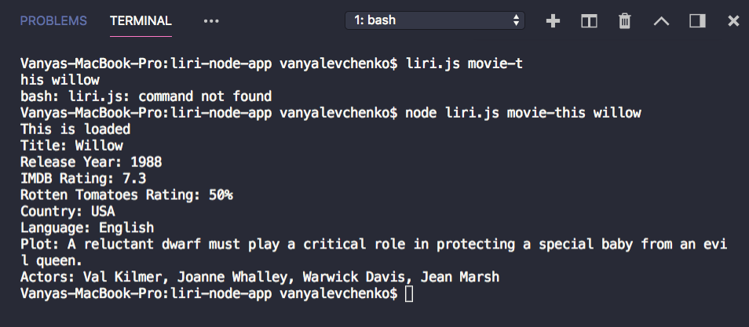

# LIRI

## Summary
Liri is a command line application written in NodeJS. It can be used to search for information about movies and songs/albums. Liri uses NodeJS, Moment, Axios, Node-Spotify-API, and OMDB API. Liri logs all previously inputed commands in the log.txt file.

### Watch a demo [Here!]()



## Usage
While in the directory of liri.js, use the command line to type a search term such as:
```
node liri.js movie-this <insert movie title>
```

This will show the following information about the song in your terminal/bash window

* Title of the movie.
* Year the movie came out.
* IMDB Rating of the movie.
* Country where the movie was produced.
* Language of the movie.
* Plot of the movie.
* Actors in the movie.
* Rotten Tomatoes Rating.
* Rotten Tomatoes URL.
* If the user doesn't type a movie in, the program will output data for the movie 'Mr. Nobody.'

```
node liri.js spotify-this-song <insert song title>
```
* Artist(s)
* The song's name
* A preview link of the song from Spotify
* The album that the song is from
* If no song is provided then your program will default to "The Sign" by Ace of Base

```
node liri.js do-what-it-says
```

* It will run spotify-this-song for "I Want it That Way,".


